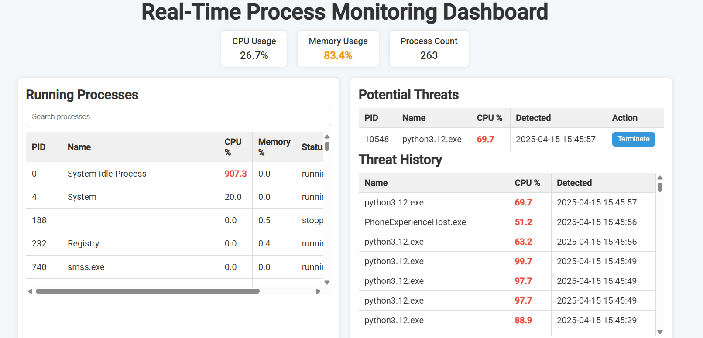
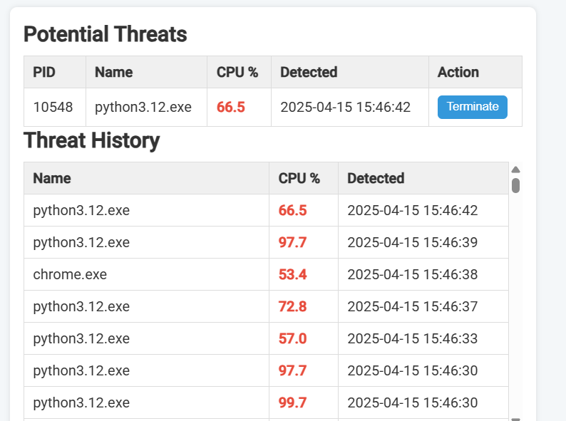
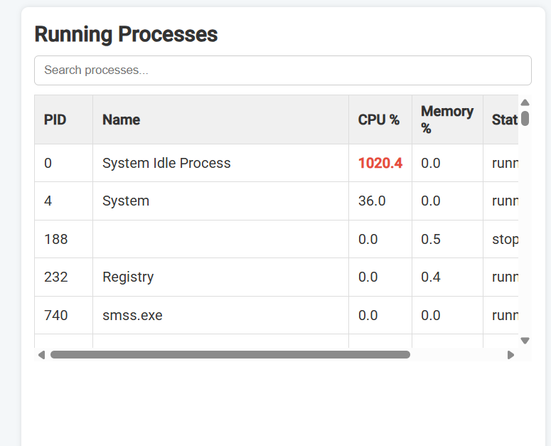
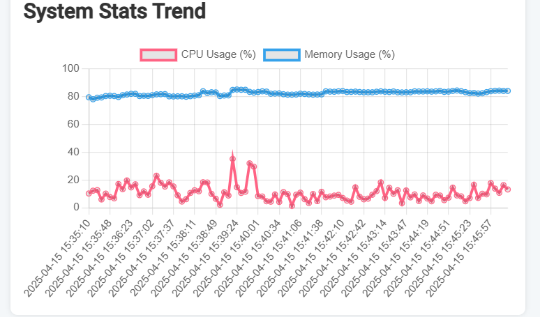

# Real-Time Process Monitoring Dashboard

## Table of Contents
- [Project Overview](#project-overview)
- [Features](#features)
- [Demo](#demo)
- [Installation](#installation)
- [Contact](#contact)

---

## Project Overview

The **Real-Time Process Monitoring Dashboard** is a powerful yet user-friendly graphical tool designed to help system administrators monitor process states, CPU usage, and memory consumption in real time. With interactive visualizations and process management capabilities, the dashboard enables proactive identification of potential issues, as well as safe and convenient management of system processes.

**Key Objectives:**
- **Real-Time Monitoring:** Continuously track live process data and system metrics.
- **Interactive Visualization:** Display data using dynamic charts and tables.
- **Process Management:** Provide controls to manage processes (e.g., terminate, restart).
- **Historical Analysis:** Maintain a history of system statistics and alerts for trend analysis.

---

## Features

- **Live Process Data:** View all running processes with real-time data on CPU, memory, and process state.
- **Potential Threat Alerts:** Highlight processes that exceed CPU usage thresholds (e.g., above 50%).
- **Interactive UI:** Filter and search processes with an intuitive dashboard.
- **Dynamic Charts:** Display historical trends of CPU and memory usage with Chart.js.
- **Process Control:** Terminate processes directly from the dashboard.
- **History & Logging:** Automatically record process anomalies and performance data for review.

## Installation

To run the project locally, follow these steps:

1. **Clone the Repository:**
   -open folder in vs code then file.
   -open terminal type--
   python -m venv venv
# Activate the virtual environment:
# On Windows:
.\venv\Scripts\activate
# On macOS/Linux:
source venv/bin/activate 
# Install the Dependencies:
pip install -r requirements.txt
# Run the application
python app.py
 

## Demo

## Contact
Name- Ambuj Kumar Maurya
Email- ambuj20maurya@gmail.com

